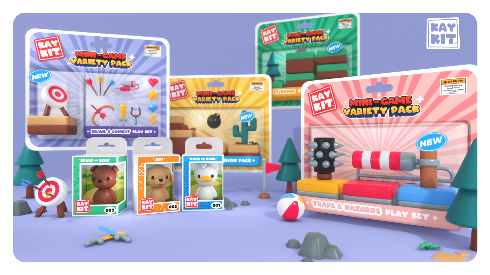

# Introduzione

Questo documento parte dal presupposto che si conoscano le basi di Unity3D \([https://unity.com/](https://unity.com/)\), in particolare:

* Come ci si muove all'interno di una scena
* Come si creano e si manipolano gli oggetti in scena
* Come acquisire ed installare pacchetti dallo Unity Asset Store \([https://assetstore.unity.com/](https://assetstore.unity.com/)\)

### File di Progetto

\[TBD\]

### Credits

Gli esercizi proposti utilizzano **Kay Kit  Mini-Game Variety Pack** disponibile al seguente indirizzo**:** [https://kaylousberg.itch.io/kay-kit-mini-game-variety-pack](https://kaylousberg.itch.io/kay-kit-mini-game-variety-pack)

