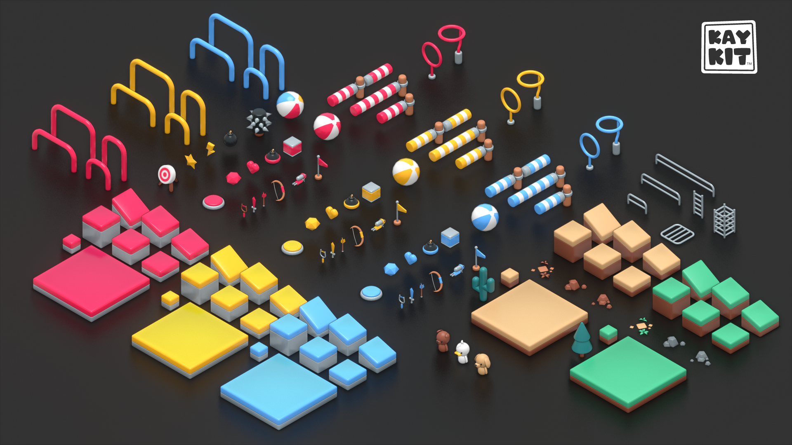
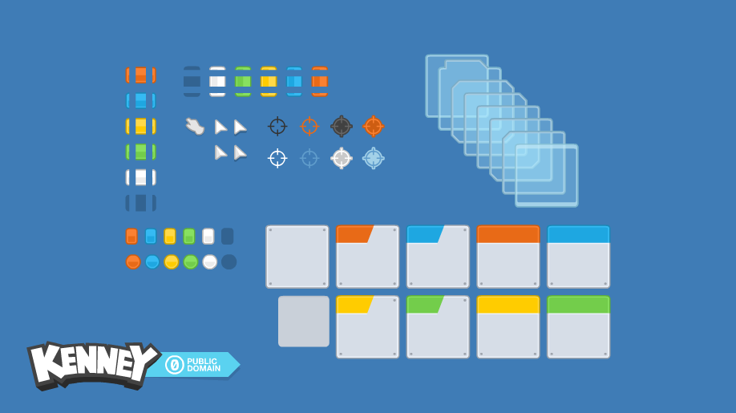

# Introduzione

Il manuale che state leggendo parte come un progetto perennemente in corso sull'utilizzo del sistema di Visual Scripting di Unity \(Bolt\).

Questo documento parte dal presupposto che si conoscano le basi di Unity3D \([https://unity.com/](https://unity.com/)\), in particolare:

* Come ci si muove all'interno di una scena
* Come si creano e si manipolano gli oggetti in scena
* Come acquisire ed installare pacchetti dallo Unity Asset Store \([https://assetstore.unity.com/](https://assetstore.unity.com/)\)

### File di Progetto

Il progetto utilizzato durante le esercitazioni è disponibile al seguente indirizzo: [https://github.com/thebitcave/gitbook-guida-bolt](https://github.com/thebitcave/gitbook-guida-bolt)


Se non si ha dimestichezza con [Git ](https://git-scm.com/)e [GitHub](https://github.com/), si consiglia di scaricare semplicemente [l'ultima versione disponibile](https://github.com/thebitcave/gitbook-guida-bolt/releases) come file _.zip_, decomprimerla ed aprirla da **Unity Hub**.



Il progetto non include Bolt, quindi sarà necessario installarlo [seguendo le istruzioni nella pagina dedicata](primi-passi-1/installare-bolt.md).


### Informazioni

Il progetto parte come ausilio per i miei studenti di [NABA ](https://www.naba.it/it)e [ScuolaFuturoLavoro](https://scuolafuturolavoro.it/), ma può essere fruito da qualsiasi insegnante che voglia introdurre i propri studenti alle basi della programmazione.


Nel caso troviate il progetto utile e vogliate supportarlo, è possibile fare una donazione su **ko-fi** \([https://ko-fi.com/marcosecchi](https://ko-fi.com/marcosecchi)\) oppure su **GitHub Sponsors** \([https://github.com/sponsors/marcosecchi](https://github.com/sponsors/marcosecchi)\).


Il manuale ufficiale di Bolt può essere trovato al seguente indirizzo: [https://docs.unity3d.com/bolt/1.4/manual/index.html](https://docs.unity3d.com/bolt/1.4/manual/index.html)

### Credits

Gli esercizi proposti utilizzano:

**Kay Kit  Mini-Game Variety Pack** disponibile al seguente indirizzo**:** [https://kaylousberg.itch.io/kay-kit-mini-game-variety-pack](https://kaylousberg.itch.io/kay-kit-mini-game-variety-pack)

**Kenney UI Pack: Space Expansion** disponibile al seguente indirizzo**:** [https://kenney.nl/assets/ui-pack-space-expansion](https://kenney.nl/assets/ui-pack-space-expansion)

