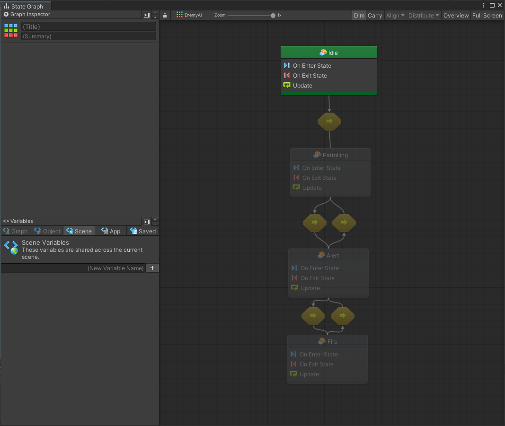

# Grafi, Macro ed Embed

### Tipi di Grafo

Un _Grafo_ \(_Graph_\) rappresenta in Bolt in modo visuale il vostro "codice". Bolt permette di crearne di due tipi:

* **Flow Graph**: dove è possibile collegare delle unità che eseguono in un determinato ordine \(chiamato _flow_\). Questo tipo di grafo è il più comune e viene solitamente utilizzato per la "programmazione" della logica di un oggetto
* **State Graph**: dove è possibile creare una serie di _stati_ e connetterli tra di loro. Ogni stato deve essere pensato come una sorta di programma che viene eseguito. Questo tipo di grafo è più comunemente utilizzato quando si vogliono creare dei comportamenti di intelligenza artificiale, o strutture ad alto livello nella logica del vostro gioco

### Macro ed Embed

Un Grafo può essere di tipo:

* **Macro**: il grafo è riutilizzabile e può essere aggiunto a differenti componenti. Dato che la Macro viene salvata nel progetto, non ha la possibilità di accedere direttamente agli oggetti presenti in una scena \(dovrà prima andare a cercarli\)
* **Embed**: il grafo è innestato direttamente nel componente e non può essere riutilizzato. Se l'oggetto che lo contiene è direttamente in scena \(cioè non viene instanziato da un prefab\), può accedere direttamente a tutti gli elementi in scena

