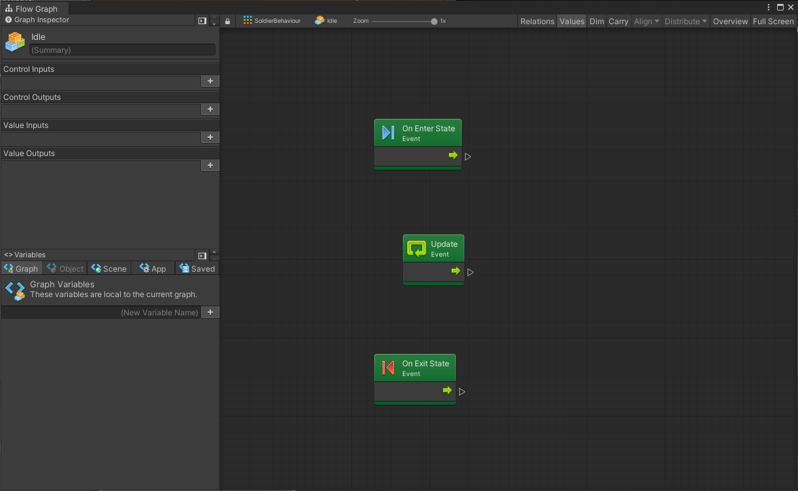
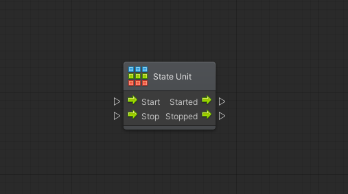

# Gli Stati

Uno **Stato** rappresenta un tipo di comportamento che il gameobject dovrebbe mantenere ad quando vi entra, fino a che non ne esce. Una serie di stati collegati vengono spesso utilizzati per realizzare una sorta di intelligenza artificiale.

Bolt permette di creare tre tipi di Stati:

* **Flow States**
* **Super States**
* **Any State**

Gli stati sono connessi tra di loro tramite [Transizioni](le-transizioni.md), che regolano il passaggio da uno stato all'altro.

Durante l'esecuzione di uno _State Graph_, uno o più stati dovranno essere definiti come quelli di partenza \(_Start State_\): uno stato di questo genere viene individuato dal colore verde. Se più stati sono selezionati come quelli di partenza, questi verranno tutti eseguiti in parallelo.

### I Flow States

Un **Flow State** contiene un [Flow Graph](../i-flow-graph-1/): questo vuole dire che al suo interno potrete utilizzare le unità nello stesso identico modo.

Per creare un _Flow State_, è sufficiente cliccare con il pulsante  destro in una zona libera del grafo e scegliere _Create Flow State_.

Per modificare il comportamento di un _Flow State_, è sufficiente effettuare un doppio click su di esso.

#### Struttura di un Flow State

All'interno di un _Flow State_, il comportamento è molto simile ad una _Flow Machine_.

Solitamente sono presenti tre eventi:

* **Update**: viene eseguito una volta per frame
* **On Enter State**: viene eseguito non appena si entra in questo stato
* **On Exit State**: viene eseguito appena prima di uscire da questo stato

Ovviamente è possibile aggiungere qulsiasi altro evento, come nei Flow States.


I valori di Input ed Output vengono solamente utilizzati per le Super Unit e non hanno un valore effettivo in questo caso


### I Super States

Un **Super State** è uno stato che contiene altri _State Graph_, permettendo una organizzazione gerarchica delle _State Machines_.

Per creare un _Super State_, è sufficiente cliccare con il pulsante  destro in una zona libera del grafo e scegliere _Create Super State_.

Per modificare la struttura di un _Super State_, è sufficiente effettuare un doppio click su di esso.

### Any State

Lo stato **Any State** permette di creare una transizione da un qualsiasi stato \(indifferentemente da quale sia\) ad un altro specifico stato.

Per creare un _Any State_, è sufficiente cliccare con il pulsante  destro in una zona libera del grafo e scegliere _Create Any State_.

### State Units

Una **State Unit** si comporta in modo molto simile ad una [Super Unit](../i-flow-graph-1/le-unita-di-un-grafo.md#innestare-i-grafi-super-units): permettono di innestare un grafo in una singola unità di un grafo genitore.

Per creare una _State Unit_, è sufficiente cliccare con il pulsante destro in una zona libera del grafo e selezionare _Nesting &gt; State Unit_.

Una _State Unit_ possiede due ingressi, che definiscono quando entrare e quando uscire dal nodo e due uscite che definiscono cosa fare, rispettivamente.

