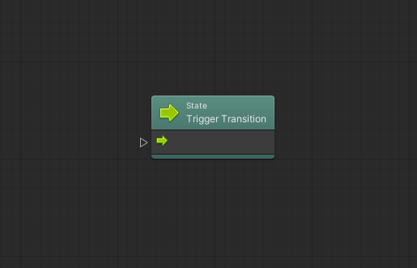
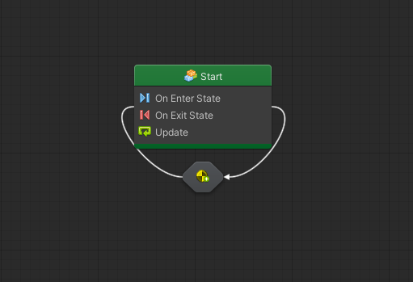

# Le Transizioni

Una **Transizione** definisce le condizioni per passare da uno stato ad un altro.

Per creare una transizione, è necessario:

* Cliccare con il pulsante destro del mouse su uno stato
* Selezionare _Make Transition_
* Spostarsi su un altro stato e rilasciare il pulsante del mouse


Tenendo premuto _Ctrl_ \(_Cmd_ su macOS\) e cliccando e trascinando con il mouse, la transizione verrà creata automaticamente.


### Modificare una Transizione

Per poter modificare una transizione, è necessario effettuare un doppio click del mouse sulla transizione stessa.

Una transizione non è altro che un _Flow Graph_ con una unità finale: _Trigger Transition_ che andrà a determinare il passaggio di uno stato all'altro. Sarà quindi necessario implementare la logica \(partendo da un evento\) che porta al cambio di stato.

#### Effettuare una Transizione su Se Stessi

Esistono dei casi in cui può essere necessario passare da uno stato allo stato stesso \(**Self Transition**\): in questi casì sarà sufficiente effettuare un click con il pulsante destro del mouse e selezionare _Make Self Transition_.

