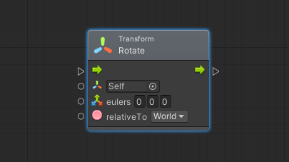
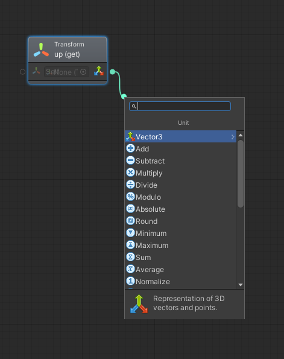

# Le Unità

Una **unità** \(o anche _nodo_\) è l'elemento base di un grafo di Bolt. Vengono visualizzati come degli elementi grafici con una serie di ingressi o **Input** \(a sinistra\) ed una serie di uscite o **Output** \(a destra\). Le connessioni indicano, tra le altre cose, l'ordine in cui queste unità debbano essere eseguite.

Esistono due tipi di connessioni o **Porte**:

* **Di Controllo**: rappresentate da un piccolo triangolo dal bordo bianco, indicano la direzione dell'esecuzione delle azioni. Una porta di uscita di questo tipo può solo essere connessa ad una porta di entrata dello stesso tipo
* **Valore**: individuate per tipo \(con una icona\) permettono di inserire dei valori \(parametri\) o recuperarli

### Creare una Unità

Per creare una unità, sono possibili due operazioni:

* Cliccare con il pulsante destro del mouse e selezionare _Add Unit_
* Cliccare sul pulsante sinistro su una porta, trascinare in un punto del grafo e rilasciare

In entrambi i casi, verrà aperto un pannello che elencherà i nodi disponibili. In fondo al pannello è disponibile una breve documentazione di cosa fa l'unità in questione.

#### Collegare due Unità

Per collegare due unità:

* Cliccare con il pulsante sinistro del mouse su una porta della prima unità
* Tenendo il pulsante premuto, trascinare il puntatore su una porta della seconda unità \(che sia possibile collegare\)
* Rilasciare il pulsante del mouse

Scollegare due Unità

Per scollegare due unità:

* Cliccare con il pulsante destro del mouse sulla porta che si vuole sconnettere

