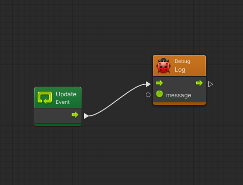
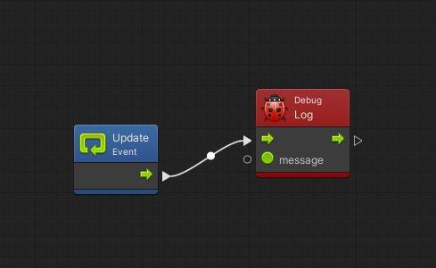
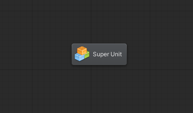
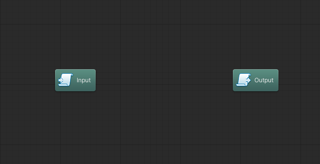
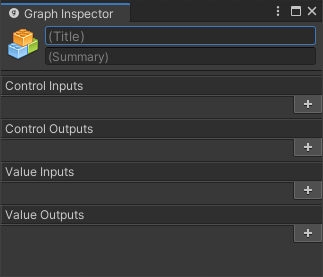
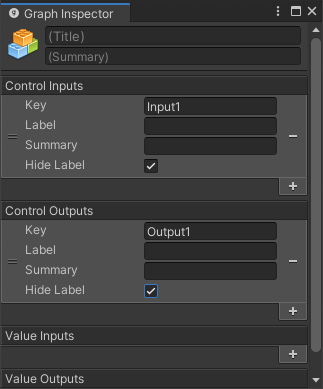
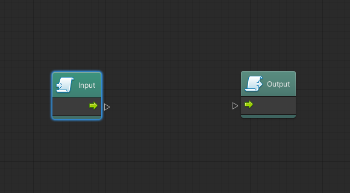
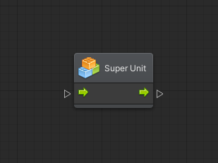

# Le Unità

Una **unità** \(o anche _nodo_\) è l'elemento base di un grafo di Bolt. Vengono visualizzati come degli elementi grafici con una serie di ingressi o **Input** \(a sinistra\) ed una serie di uscite o **Output** \(a destra\). Le connessioni indicano, tra le altre cose, l'ordine in cui queste unità debbano essere eseguite.

Esistono due tipi di connessioni o **Porte**:

* **Di Controllo**: rappresentate da un piccolo triangolo dal bordo bianco, indicano la direzione dell'esecuzione delle azioni. Una porta di uscita di questo tipo può solo essere connessa ad una porta di entrata dello stesso tipo
* **Valore**: individuate per tipo \(con una icona\) permettono di inserire dei valori \(parametri\) o recuperarli

### Creare una Unità

Per creare una unità, sono possibili due operazioni:

* Cliccare con il pulsante destro del mouse e selezionare _Add Unit_
* Cliccare sul pulsante sinistro su una porta, trascinare in un punto del grafo e rilasciare

In entrambi i casi, verrà aperto un pannello che elencherà i nodi disponibili. In fondo al pannello è disponibile una breve documentazione di cosa fa l'unità in questione.

#### Collegare due Unità

Per collegare due unità:

* Cliccare con il pulsante sinistro del mouse su una porta della prima unità
* Tenendo il pulsante premuto, trascinare il puntatore su una porta della seconda unità \(che sia possibile collegare\)
* Rilasciare il pulsante del mouse

Scollegare due Unità

Per scollegare due unità:

* Cliccare con il pulsante destro del mouse sulla porta che si vuole sconnettere

### Individuazione di Possibili Errori

Esistono alcuni casi in cui Bolt riesce a prevedere la possibilità di un errore. In questi casi, l'unità verrà colorata in arancione.

### Errori in Fase di Esecuzione

Durante l'esecuzione del programma, nel caso venga trovato un errore, Bolt lo segnalerà colorando l'unità "incriminata" con il colore rosso. Una unità senza errori in _Play Mode_ viene colorata di blu.

### Innestare i Grafi \(Super Units\)

All'interno di un grafo è possibile innestare altri grafi, che vengono chiamati **Super Unità** \(**Super Units**\). E' possibile creare una unità di questo genere cliccando con il pulsante destro del mouse e selezionando _Nesting &gt; Super Unit_.

Tramite doppio click sul nodo, sarà possibile "entrare" in esso e sarà possibile modificarlo come un qualsiasi altro grafo.

Una super unit possiede due elementi già inseriti:

* **Input**: permette di definire gli elementi in ingresso e i parametri che possono essere passati
* **Output**: permette di definire gli elementi in uscita ed i valori che la super unit può ritornare

#### Impostare Input e Output

I valori di Input e Output possono essere definiti tramite la finestra del _Graph Inspector_ \(Window _&gt; Graph Inspector_\).

Nell'immagine seguente, sono stati definiti un valore di Input e uno di Output:

Il risultato, nel grafo, sarà il seguente:

Il nodo, nel grafo "genitore", avrà il seguente aspetto:

