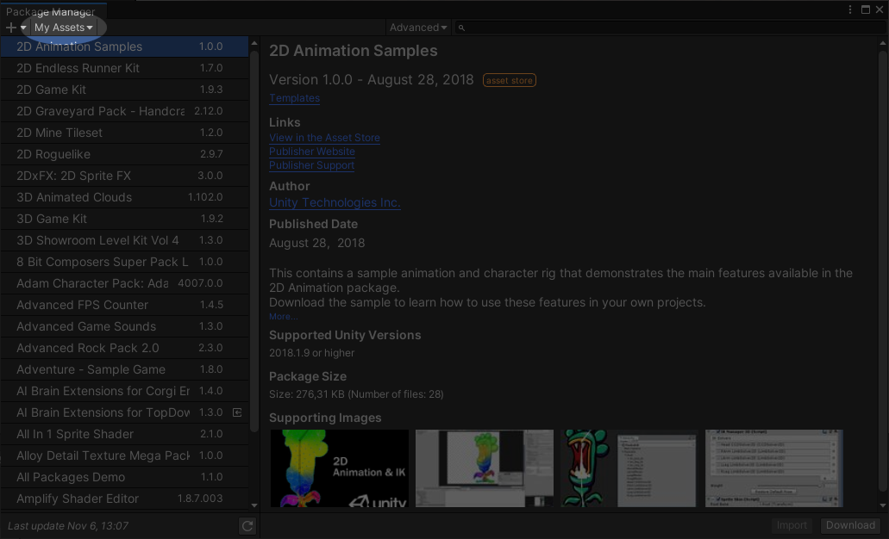
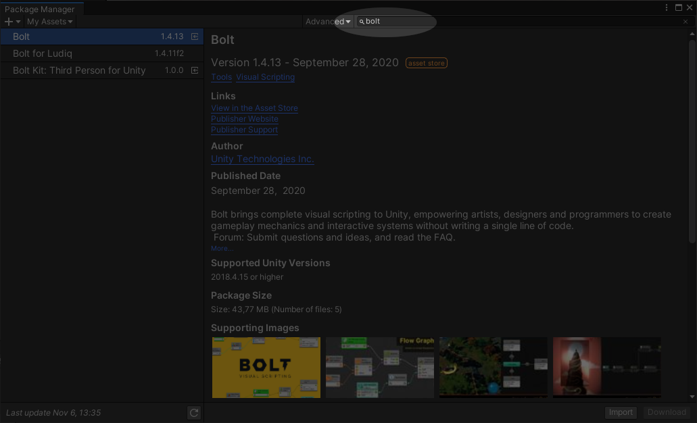
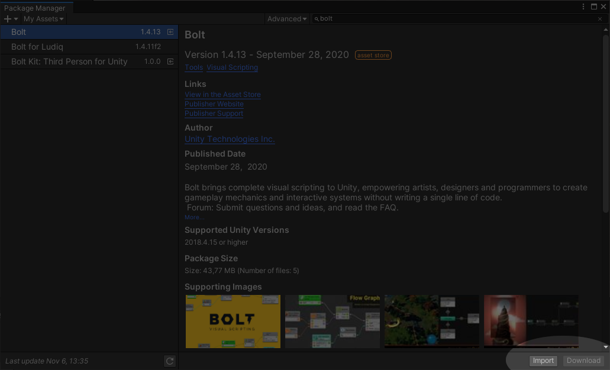
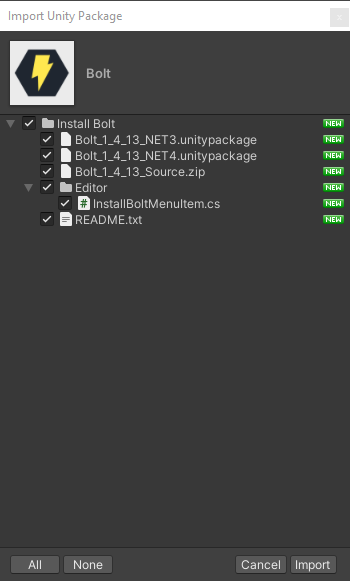

# Installare Bolt

Per installare Bolt sul vostro progetto Unity sarà prima necessario "acquistarlo" \(è gratis!\) dall'Asset Store, visitando il seguente indirizzo web: [https://assetstore.unity.com/packages/tools/visual-scripting/bolt-163802](https://assetstore.unity.com/packages/tools/visual-scripting/bolt-163802).

Una volta aggiunto alla vostra libreria, sarà possibile aggiungerlo al progetto tramite il _Package Manager_ di Unity:

* Una volta aperto Unity, selezionare, dal menu principale _Window &gt; Package Manager_
* Una volta aperta la finestra corrispondente, aprire la sezione My Assets dal menu che troverete in alto a destra

* Nel motore di ricerca, a destra, scrivere _Bolt_ per recuperare la plug-in

In basso a destra, sarà possibile scaricare Bolt, tramite il pulsante _Download_ oppure _Update_ \(se è disponibile un aggiornamento\):

* Cliccate _Download_ o _Update_ ed attendete che l'estensione venga scaricata
* Una volta completato lo scaricamento, si attiverà il pulsante _Import_: cliccatelo

Si aprirà una finestra con titolo _Import Unity Package_

* Senza modificare nulla, cliccate sul pulsante _Import_

Finita la fase di importazione, dovrebbe comparire, nel menu principale di Unity, una voce _Tools_:

* Selezionare _Tools &gt; Install Bolt_ per aprire una seconda finestra di importazione simile alla precedente
* Cliccare ancora su _Import_

