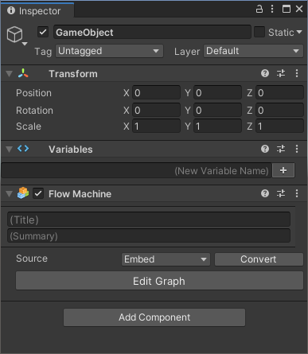
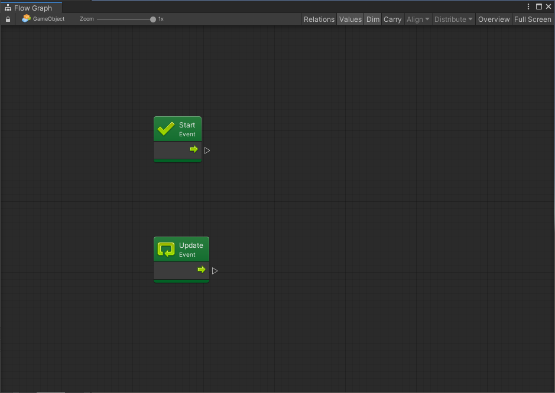
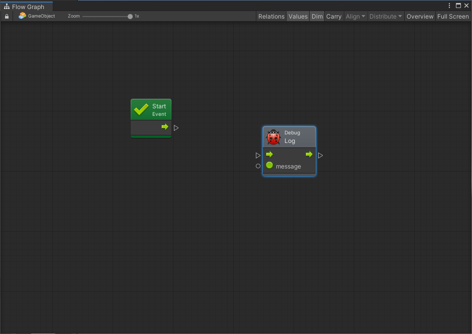
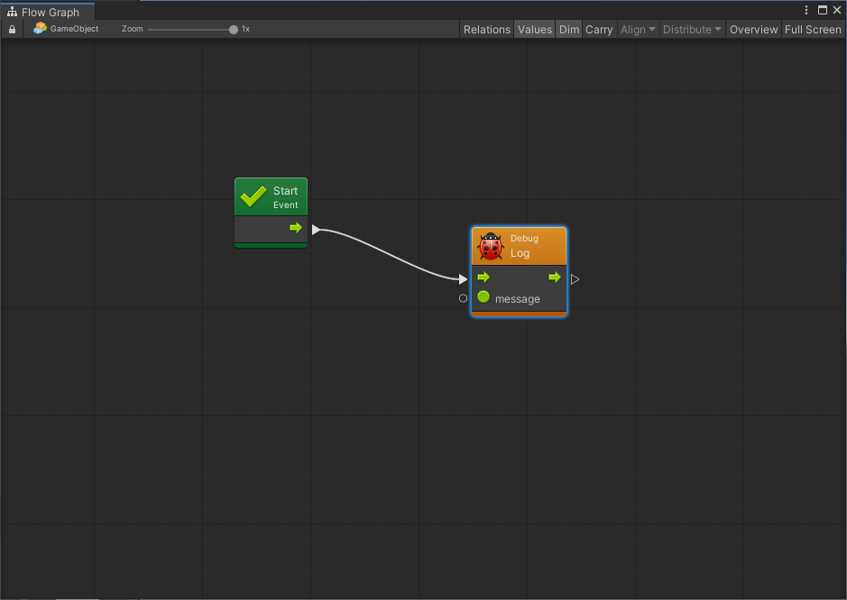
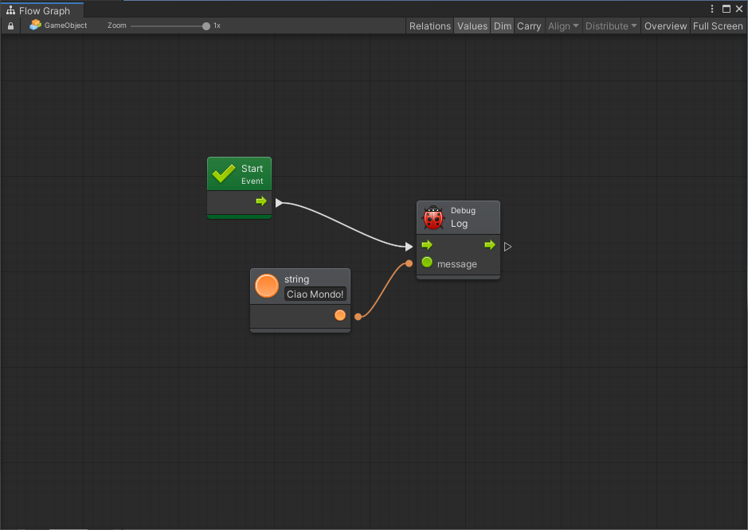

# Lezione 01 - Creare una Flow Machine

In questa lezione andremo a creare una semplice applicazione che andrà a scrivere del testo all'interno della console. In particolare andremo a creare una [Flow Machine]() ed inseriremo un semplice comando di scrittura.

Una Flow Machine non è altro che uno script di Bolt che ci permette di inserire, all'interno di un grafo, una serie di azioni e collegarle tra di loro.


La scena da aprire, nel caso si stia utilizzando il progetto di supporto, è **Lezione 01 - Hello World**.


### Creare la Flow Machine

Per prima cosa andiamo a creare un oggetto in scena ed aggiungiamo uno di questi elementi:

* Aggiungiamo un gameobject vuoto \(_GameObject &gt; Create Empty_\)
* Selezioniamo il gameobject e, nell'_Inspector_, aggiungiamo un componente cliccando il pulsante _Add Component_
* Selezioniamo _Bolt &gt; FlowMachine_ per aggiungere il componente
* Nel componente appena aggiunto, nel campo Source, selezioniamo _Embed_

Noterete che è stato aggiunto anche un componente _Variables_: in seguito andremo a vedere il suo utilizzo.

### Modificare il Graph

Siamo ora pronti ad aggiungere il nostro script visuale:

* Clicchiamo sul pulsante _Edit Graph_ nel componente _Flow Machine_
* Si aprirà una finestra con due elementi di colore verde: _Start_ e _Update_

* Selezioniamo l'elemento Update e, con il tasto destro del mouse, eliminiamolo \(Delete\): in questo esercizio non ci servirà 

### Aggiungere una Unità

Siamo ora pronti a scrivere un messaggio all'interno della _Console_: questa operazione, in Unity, si esegue tramite il comando [Debug.Log\(\)](https://docs.unity3d.com/Manual/class-Debug.html).

* Clicchiamo il pulsante destro del mouse all'interno del _Flow Graph_
* nel campo di ricerca della finestra che si presenterà, inseriamo _Debug.Log_
* Selezioniamo _Debug.Log\(message\)_ per aggiungere l'unità

### Completare il Grafo

Ora che abbiamo il nodo per scrivere il messaggio dobbiamo fare in modo che questo venga eseguito \(provate ad andare in _Play_ e vedrete che non succede nulla\) e mostrare un testo.

* Cliccate sul piccolo triangolo in uscita dallo _Start_ e mantenendo il pulsante del mouse premuto andate sul triangolo in ingresso dell'unità _Debug.Log_
* Rilasciate il pulsante del mouse per completare il collegamento. Il nodo diventerà arancione perché gli manca il messaggio da mostrare

Dobbiamo ora aggiungere un messaggio:

* Cliccare sul _pin_ di ingresso \(cerchiolino bianco\) di fianco al testo _message_ e trascinare mantenendo il pulsante premuto
* Rilasciare il pulsante e selezionare _string Literal_ \(che ci permette di definire un testo\). Verrà aggiunta una unità con un campo di inserimento testo vuoto
* Nel campo inserire un testo qualsiasi, ad esempio _Ciao Mondo!_

### Eseguire il codice

Siamo pronti ad eseguire il codice e tracciare il messaggio:

* Cliccare sul pulsante Play
* In Console dovrebbe apparire il messaggio _Ciao Mondo!_

