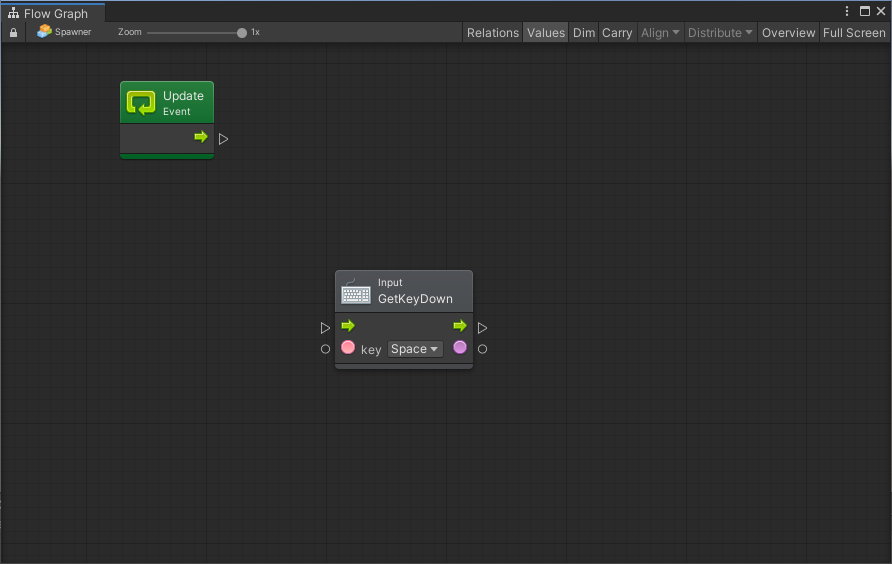
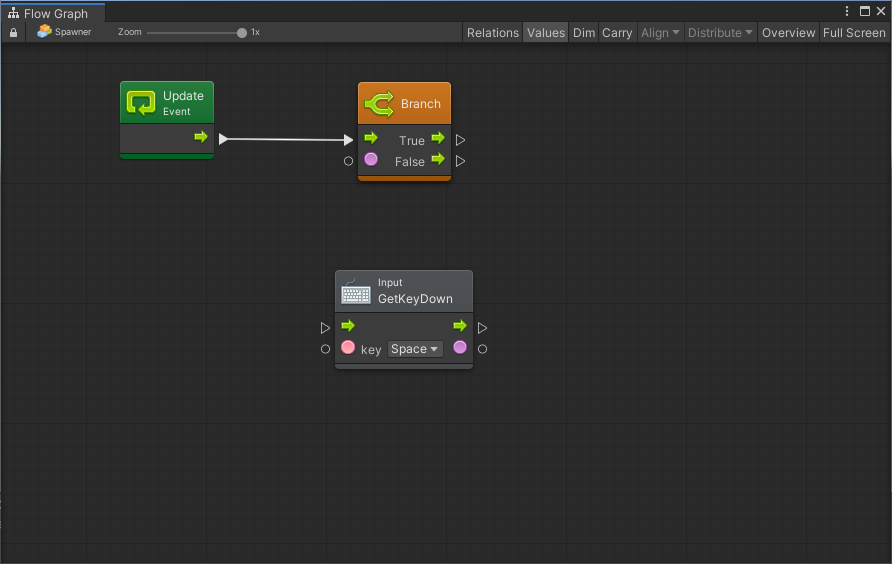
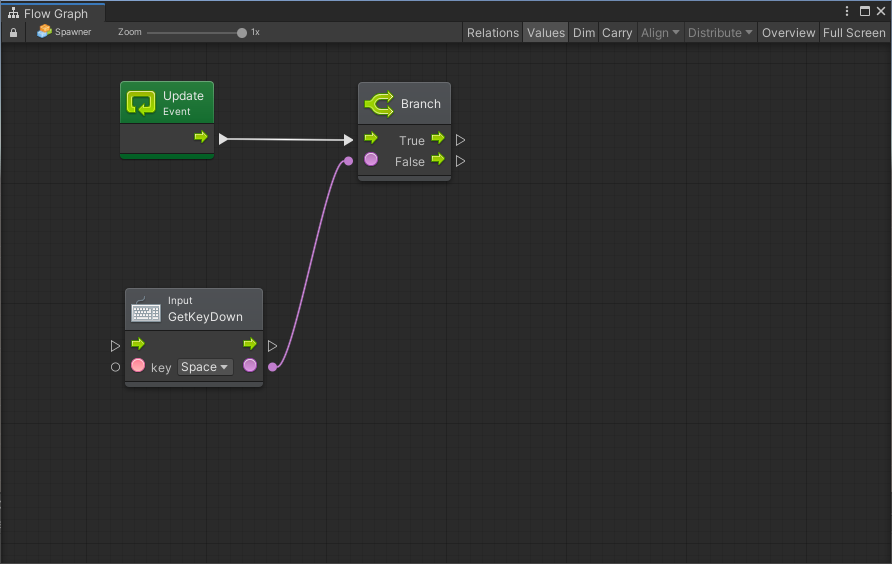
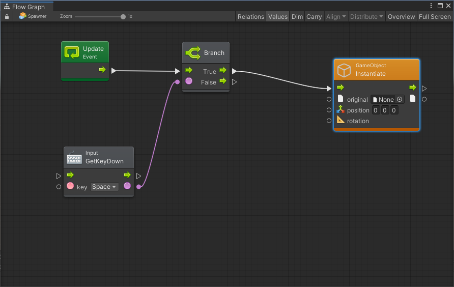
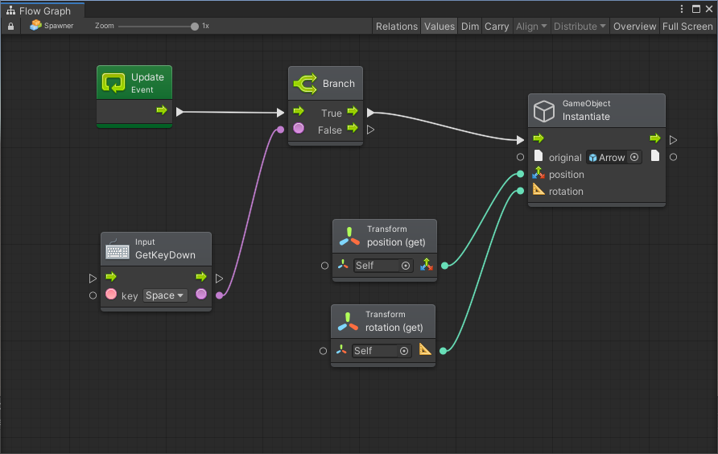

# Lezione 03 - Clonare un Oggetto

Per poter creare un oggetto in scena a partire da un prefab, si può utilizzare il metodo _Instantiate_. 


Per questa lezione, si consiglia di utilizzare la scena **Lezione 03 - Clonare un Oggetto** inclusa [nel progetto di supporto](https://github.com/thebitcave/gitbook-guida-bolt/releases).


### Aprire la Scena

Una volta aperta la scena di supporto, sarà possibile visualizzare un oggetto _Spawner_:

* Selezioniamo il gameobject _Spawner_ e notiamo che è già presente il componente _Flow Machine_.
* Apriamo il grafo cliccando su _Edit Graph_ nell'Inspector
* Eliminiamo il nodo _Start_ perché non ci servirà

### Intercettare la Pressione di un Tasto

Durante l'evento _Update_ andremo a controllare se il giocatore ha premuto un tasto della tastiera e, in caso positivo, andremo a creare un oggetto.

* Selezioniamo il gameobject _Spawner_ ed apriamo il grafo \(pulsante _Edit Graph_\)
* Clicchiamo in una zona libera del grafo e selzioniamo _Add Unit_
* Cerchiamo l'unità Input.GetKeyDown ed aggiungiamola al grafo
* Dal menu key selezionamo _Space_


L'unità `Input.GetKeyDown` permette di sapere se in un determinato frame è stato premuto un tasto della tastiera: nel caso questo sia avvenuto, verrà restituito al pin di uscita \(di tipo _bool_\) il valore _true_, altrimenti _false_.


### Controllo del Flusso

Vogliamo generare i nostri oggetti solamente se il tasto è stato premuto: collegare quindi l'unità che abbiamo appena creato con l'evento Update sarebbe un errore. Abbiamo quanti bisogno di un sistema per effettuare questo controllo e lo possiamo fare tramite l'unità _Branch_, che ci permette di eseguire una porzione di codice solamente se una condizione è vera.

* Clicchiamo sul pin di uscita di _Update_ e rilasciamo in un punto libero del grafo
* Cerchiamo l'unità _Branch_ per aggiungerla


L'unità _Branch_ apparirà arancione perché non abbiamo ancora aggiunto la condizione di esecuzione


* Colleghiamo il valore si uscita dell'unità _GetKeyDown_ \(pin circolare\) con l'elemento dello stesso colore del _Branch_: abbiamo cioè aggiunto la condizione di esecuzione del codice

### Instanziare un Oggetto

Dobbiamo ora creare il nostro oggetto e questo lo possiamo fare tramite l'unità Instantiate che, partendo da un gameobject \(ad esempio, un prefab\) ne genera un clone e lo aggiunge in scena

* Dal pin di esecuzione _true_ del _Branch_, clicchiamo e trasciniamo, rilasciando in un punto libero della scena
* Cerchiamo l'unità _GameObject.Instantiate\(original, position, rotation\)_, che ci permette di generare un oggetto dal prefab _original_ in una determinata posizione e rotazione
* All'interno del campo origina, trasciniamo il prefab _Arrow_ che troviamo in _Lezione 03 - Clonare un Oggetto/Prefabs_

Dobbiamo indicare in che punto e a che rotazione vogliamo che l'oggetto venga istanziato in scena. Nel nostro caso utilizzeremo l'oggetto stesso che contiene il grafo, cioè il gameobject _Spawner_:

* _Aggiungiamo una unità Transforom.position \(get\)_
* _Aggiungiamo una unità Transforom.rotation\(get\)_
* Colleghiamo all'unità _Instantiate_ i pin corrispondenti

### Testare il Grafo

Mandando in Play la scena, dovrebbe essere possibile lanciare una freccia ogni volta che si preme il tasto Space

### Esercizio Integrartivo

Come esercizio addizionale:

* Duplicare il gameobject _Spawner_ tre o quattro volte
* Per ogni _Spawner_, modificare il grafo in modo tale che sia possibile lanciare la freccia alla pressione di tasti differenti \(ad esempio 1, 2, 3, 4\)

