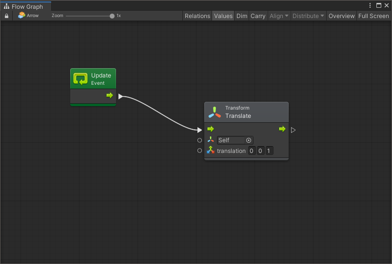
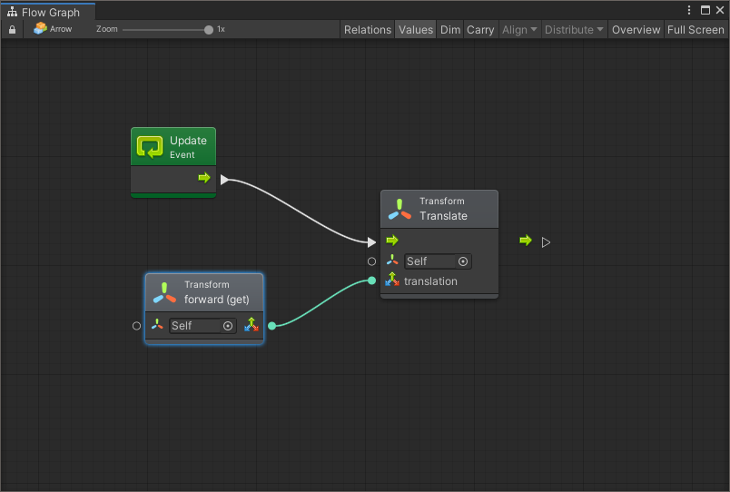
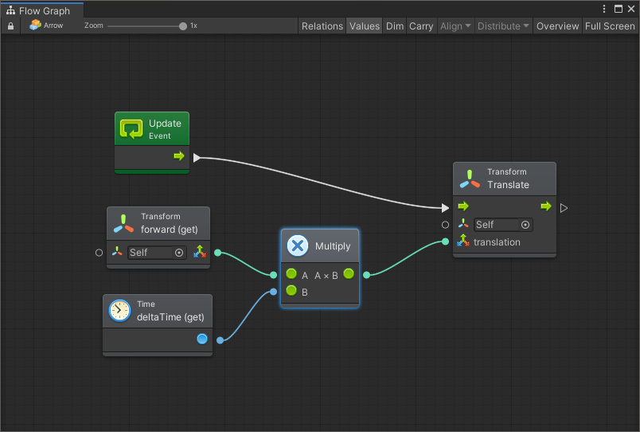
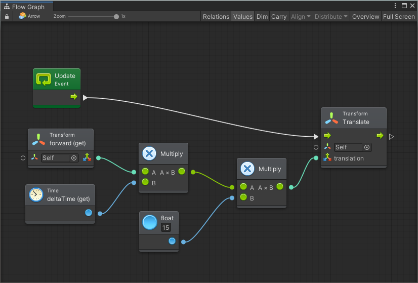

# Lezione 2 - Spostare un Oggetto

Esistono diverse possibilità nel caso si volesse spostare un oggetto in scena: una di queste è quella di traslarlo intervenendo sul suo _Transform_ \(in particolare, i valori di _position_\).


Per questa lezione, si consiglia di utilizzare la scena **Lezione 02 - Spostare un Oggetto** inclusa [nel progetto di supporto](https://github.com/thebitcave/gitbook-guida-bolt/releases).


### Aprire la Scena

Una volta aperta la scena di supporto, sarà possibile visualizzare una freccia:

* Selezioniamo il gameobject Arrow e notiamo che è già presente il componente _Flow Machine_.
* Apriamo il grafo cliccando su _Edit Graph_ nell'Inspector
* Eliminiamo il nodo _Start_ perché non ci servirà

### L'Evento Update

L'evento che rimane, Update permette di eseguire del codice _una volta_ per frame: per fare un esempio, se il nostro gioco gira a 100FPS \(_Frame per Secondo_\), Update verrà eseguito approssimativamente cento volte in un secondo \(gli FPS non sono mai costanti\).

Il nostro intento è quello di spostare di un breve passo la freccia ad ogni esecuzione.

### L'Attributo Position

La posizione \(**position**\) di un oggetto è data da tre valori \(x, y, z\) che indicano, rispettivamente la posizione nello spazio rispetto alle direzioni _destra/sinistra_, _su/giù_, _avanti/indietro_. Per identificare una serie di valori di questo genere, si utilizza l'elemento [Vector3](https://docs.unity3d.com/ScriptReference/Vector3.html).


Se volessi spostare verso l'alto un oggetto, dovrei sommare al valore _y_ della _position_ un numero positivo, ad esempio _\(0, 4, 0\)_ Se invece volessi spostarlo verso il basso, dovrei utilizzare un valore negativo, ad esempio _\(0, -6, 0\)_.


### Muovere l'Oggetto

Per poter muovere la nostra freccia, utilizzeremo l'unità _Translate_, che permette di spostare un oggetto un una determinata direzione \(data da un valore _Vector3_\).

* Aggiungere nel grafo l'unità _Transform.Translate\(translation\)_
* Collegarla con l'uscita di _Update_
* Nel campo _translation_, inserire i valori _0, 0, 1_
* Salvare premere _Play_

Una volta in esecuzione, noterete che la freccia si sposta in avanti in modo estremamente veloce \(un metro per frame\).

### Controllare la Velocità

Al momento la velocità della freccia è stata inserita all'interno dei campi. Possiamo però cercare di controllare il tutto inserendo un valore esterno. Ci servono i seguenti elementi:

* [ ] Una direzione dove muoverci
* [ ] L'indipendenza dal framerate
* [ ] Una velocità di movimento

#### Impostare la direzione

La prima cosa che dobbiamo fare è "portare fuori" dall'unità il valore inserito.

* Cliccare sulla porta di _translation_ e trascinare rilasciando in un punto libero del grafo
* Cercare e selezionare _Transform.forward \(get\)_

L'operazione appena effettuata non cambia nulla della nostra scena \(provare per credere\), ma ci permette di modificare il valore in ingresso

#### Indipendenza dal Framerate

Al momento, lo spostamento della freccia è dipendente dai frame per secondo della nostra applicazione: infatti l'oggetto si muove di un metro per frame. Devo cercare di rendere il movimento indipendente dal tempo intercorso tra un frame e l'altro.

* Aggiungere una unità _Time.deltaTime \(get\)_
* Aggiungere una unità _Multiply \(in Math/Generic\)_
* Collegare le unità come in figura
* Lanciare l'applicazione

Quello che noteremo è che ora la freccia si muove molto lentamente: questo avviene perché abbiamo moltiplicato la nostra direzione per un numero estremamente basso: questo numero, chiamato _deltaTime_, è il tempo intercorso tra un frame e l'altro.

Abbiamo quindi ottenuto l'indipendenza dal framerate: dobbiamo solamente permettere di gestire la velocità di movimento.

#### Velocità di Movimento

\[TBD\]

