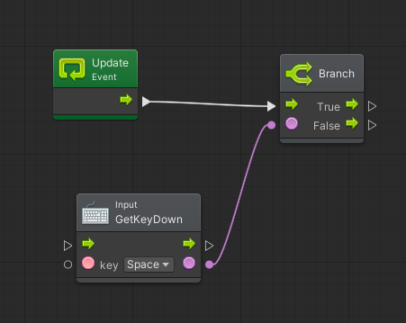
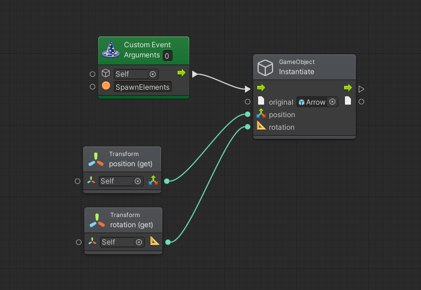
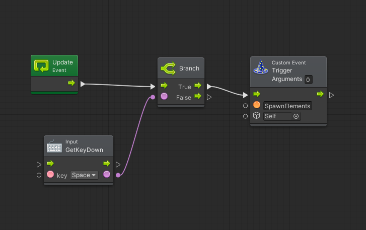
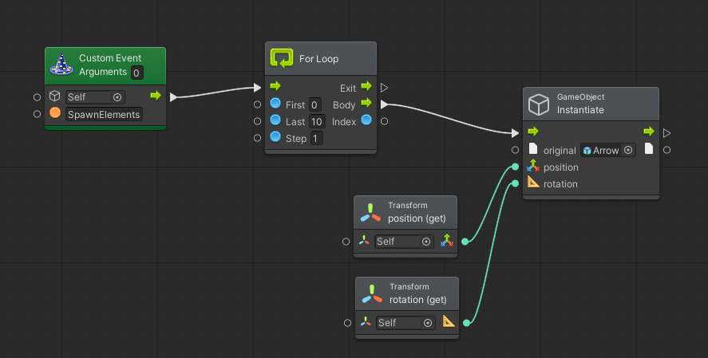
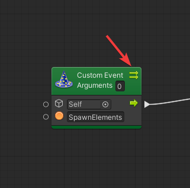
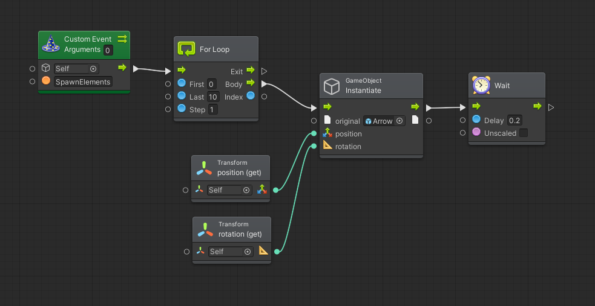
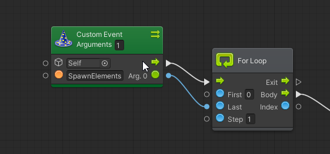

# Lezione 04 - Utilizzare le Coroutines

In Unity, ma anche nella programmazione in generale, una [Coroutine ](https://docs.unity3d.com/Manual/Coroutines.html)è una funzione che può essere messa in pausa e riattivata all'avverarsi di alcuni particolari eventi \(es.: al frame successivo, dopo un determinato periodo, etc.\).


Per questa lezione, si consiglia di utilizzare la scena **Lezione 04 - Utilizzare le Coroutines** inclusa [nel progetto di supporto](https://github.com/thebitcave/gitbook-guida-bolt/releases).


### Aprire la Scena

Una volta aperta la scena di supporto, sarà possibile visualizzare un oggetto _Spawner_:

* Selezioniamo il gameobject _Spawner_ e notiamo che è già presente il componente _Flow Machine_.
* Apriamo il grafo cliccando su _Edit Graph_ nell'Inspector
* Noteremo che è presente un singolo evento _Update_ che intercetta la pressione del tasto _Space_

### Creare un Evento Personalizzato

Un **Evento Personalizzato** \(**Custom Event**\) ci permette di creare un evento simile a quelli già presenti in Unity ma che potremo eseguire a nostro piacimento dallo stesso grafo o da grafi esterni.


Per avere una panoramica di come è possibile utilizzare gli Eventi Personalizzati, aprire la scena **Esempio 01 - Eventi Personalizzati** nel progetto di supporto.


Un Evento Personalizzato è di solito formato da due entità:

* L'evento vero e proprio: che andrà ad eseguire i nodi contenuti
* L'attivatore dell'evento \(_trigger_\): che comanderà all'evento di eseguire il suo contenuto

Nel nostro caso vogliamo generare una serie di oggetti in una sequenza temporizzata \(es.: generare dieci frecce una alla volta\).

Cominciamo con il creare un Evento Personalizzato:

* Nel grafo dello Spawner, clicchiamo il pulsante destro in uno spazio vuoto e selezioniamo _Event &gt; Custom Event_
* Nel secondo campo \(quello con l'identificatore arancione\) inseriamo il nome dell'evento: _SpawnElements_
* In modo del tutto simile a quanto fatto nella _Lezione 03_, generiamo un prefab \(_Arrow_\) aggiungendo un nodo **Instantiate**, come mostrato nella seguente immagine:

### Attivare l'Evento

Al contrario degli eventi di Unity, un evento personalizzato deve essere lanciato all'interno del nostro codice tramite un attivatore \(**Trigger**\):

* Dall'uscita True del nodo Branch, clicchiamo e trasciniamo creando un nodo _Event &gt; Trigger Custom Event_
* Nel secondo campo \(quello con l'identificatore arancione\) inseriamo il nome dell'evento che vogliamo eseguire: _SpawnElements_

Provando ad eseguire l'applicazione, potremo notare che la freccia viene generata ogni volta che andremo a premere la barra spaziatrice.

Rispetto alla lezione precedente, abbiamo slegato l'esecuzione dei nodi che generano la freccia dal controllo dell'interazione con il giocatore.

### Generare Elementi Multipli

Torniamo al nostro evento personalizzato: la nostra intenzione è di generare una serie di frecce invece di una singola.


Per poter eseguire un numero finito di volte una serie di istruzioni, una delle possibilità è quella di usare l'unità **For Loop**.


* Tra i nodi _Custom Event_ e _Instantiate_, inseriamo una unità For Loop, come mostrato nella figura seguente:

Notare che il pin di uscita utilizzato è **Body**: tutto ciò che segue verrà eseguito una volta per ogni ciclo \(nel nostro caso, 10 volte\).

Il nodo **Exit** ci permette di "proseguire" l'esecuzione di altro codice una volta finiti i cicli.

Provate ad eseguire l'applicazione: noterete che, ogni volta che viene premuta la barra spaziatrice, vengono generate 10 frecce contemporaneamente.

### Temporizzare l'Esecuzione delle Unità

I comandi vengono solitamente eseguiti immediatamente uno dopo l'altro e non è possibile "aspettare" del tempo prima di eseguire quello successivo. Per poter effettuare una operazione di questo tipo, è necessario ricorrere ad una [Coroutine](https://docs.unity3d.com/Manual/Coroutines.html) che non segue il regolare svolgersi dei comandi e può essere messa in pausa.

Dobbiamo prima di tutto trasformare il nostro evento personalizzato in una Coroutine:

* Selezioniamo il _Custom Event_ e, nel _Graph Inspector_, selezioniamo la spunta _Coroutine_
* Noteremo che nella unità apparirà una icona identificativa

Per temporizzare l'esecuzione dei comandi, aggiungiamo un ritardo:

* All'uscita del nodo _Instantiate_, aggiungiamo il nodo _Time &gt; Wait for Seconds_
* Nel campo Delay, inseriamo il valore _0.2_ \(secondi\)

Provate ad eseguire l'applicazione e vedrete che ora le frecce vengono generate una di seguito all'altra con un ritardo di 200 millisecondi

### Ultime Migliorie

Il sistema è funzionante, ma può essere migliorato con alcuni piccoli ritocchi.

#### Gestire il Numero di Oggetti Generati

Al momento il numero di elementi generati è fissato a 10: possiamo rendere più flessibile il nostro evento personalizzato tramite l'aggiunta di un parametro \(**Argument**\):

* Nel nodo _Custom Event_, sostituire inserire il valore _1_ nel campo _Arguments_
* Apparirà un pin in uscita di colore verde
* Collegare il pin \(che sarà il nostro parametro in ingresso\) con il valore _Last_ dell'unità _For Loop_

Il parametro in ingresso dovrà essere "passato" dal trigger:

* Nell'unità _Trigger Custom Event_ inseriamo il valore _1_ nel campo Arguments: comparirà un pin in ingresso
* 
#### Interrompere le Interazioni in fase di Esecuzione

