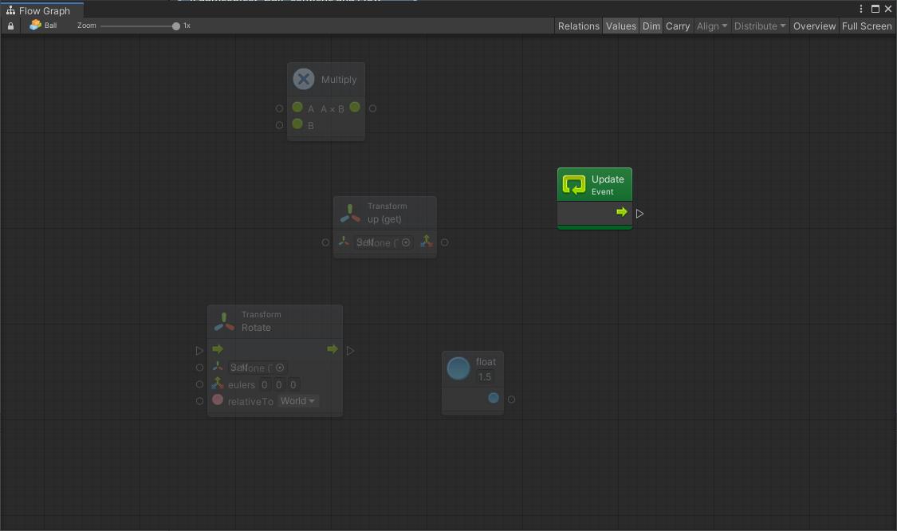

# Primi Passi

In questa sezione vengono introdotti i concetti base di Bolt, partendo dalla sua installazione all'interno di un progetto Unity, fino alla creazione di grafi con l'inserimento di logiche di programmazione.

