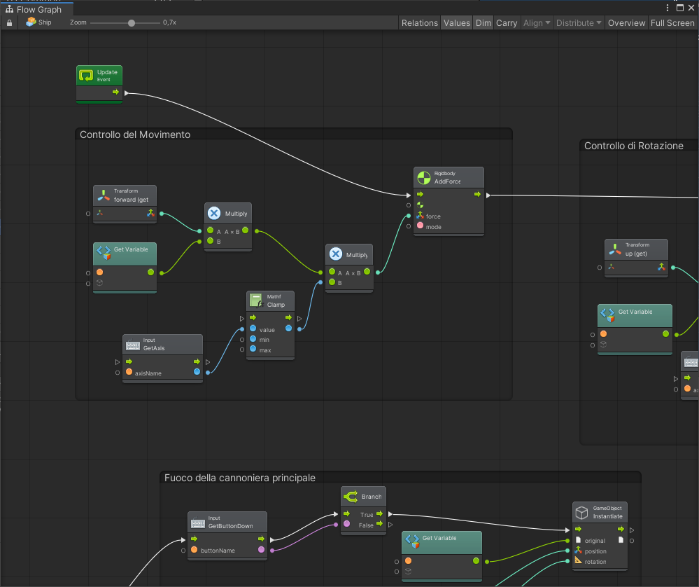
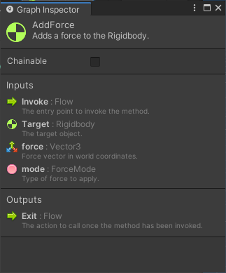
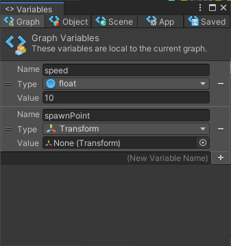

# Le Finestre Principali

Esistono tre finestre principali in Bolt:

* _Graph_
* _Graph Inspector_
* _Variables_

### La Finestra Graph

Il _Graph_ rappresenta la finestra principale di Bolt, dove andrete a scrivere la maggior parte delle logiche del vostro progetto.

### La Finestra Graph Inspector

Il _Graph Inspector_ permette di visualizzare le informazioni di un nodo \(mostrandone una breve documentazione\) oppure, nel caso di un grafo, di configurarlo con elementi di Input e Output.

### La Finestra Variables

La finestra _Variables_ permette di configurare variabili, di diverso tipo, collegate all'oggetto, al grafo, alla scena, etc.

